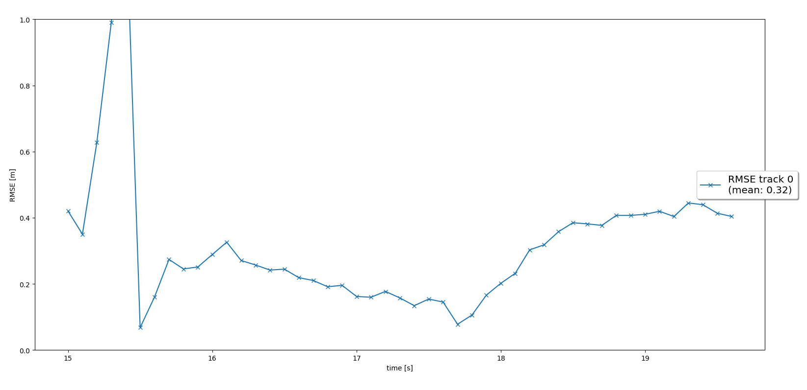
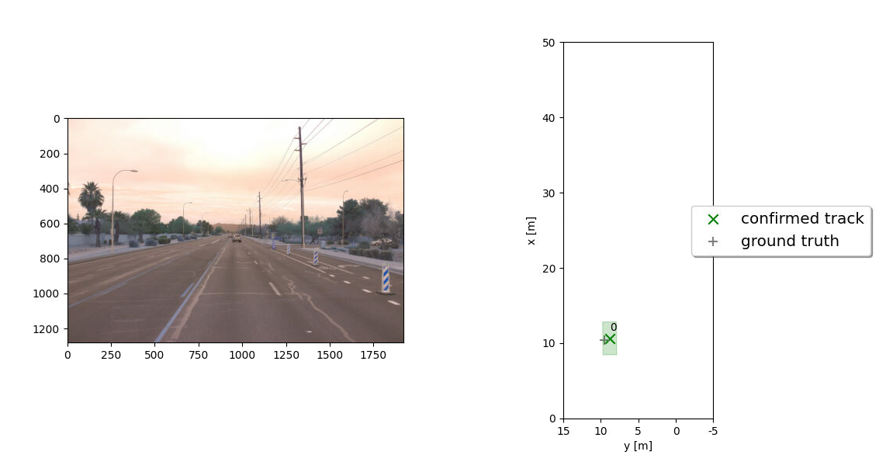
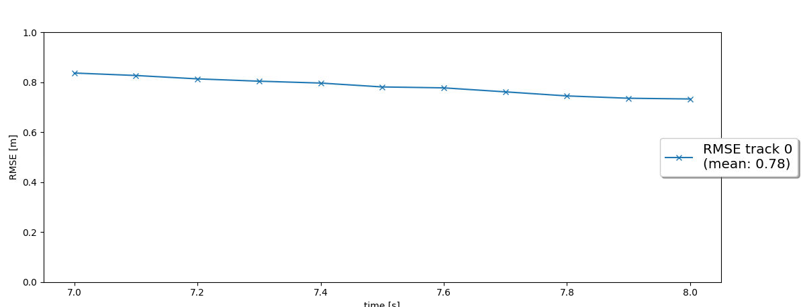
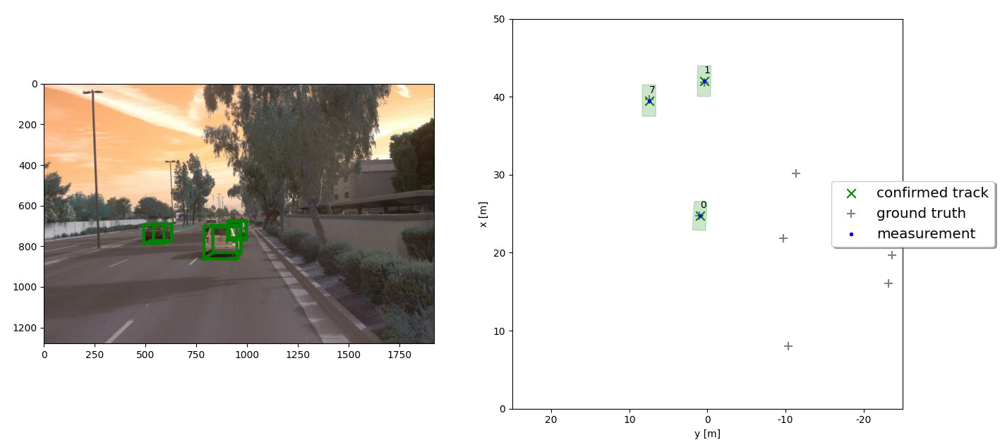
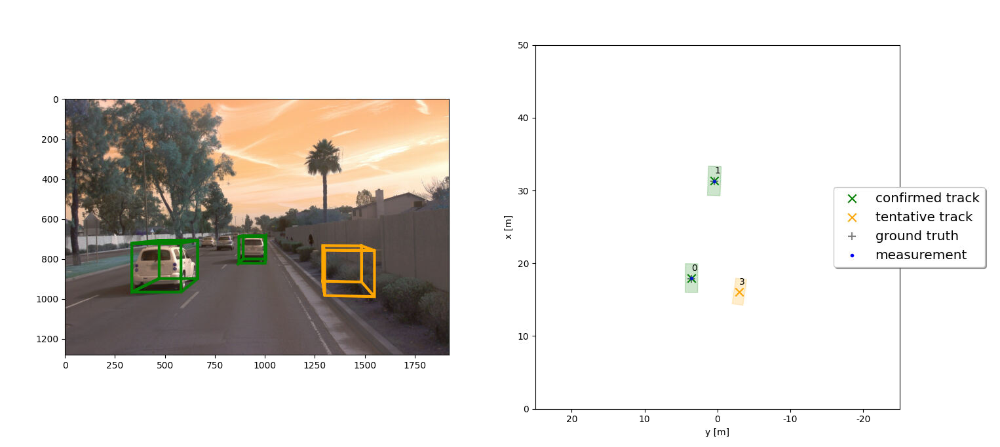
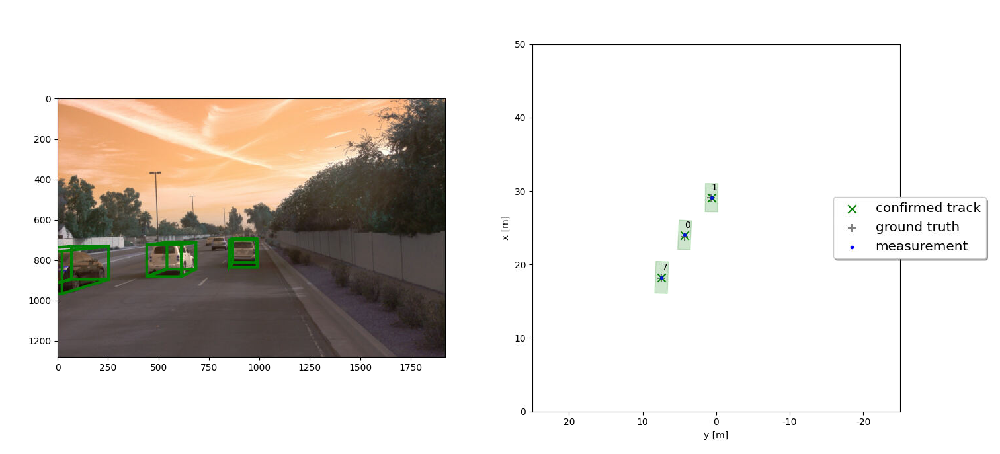
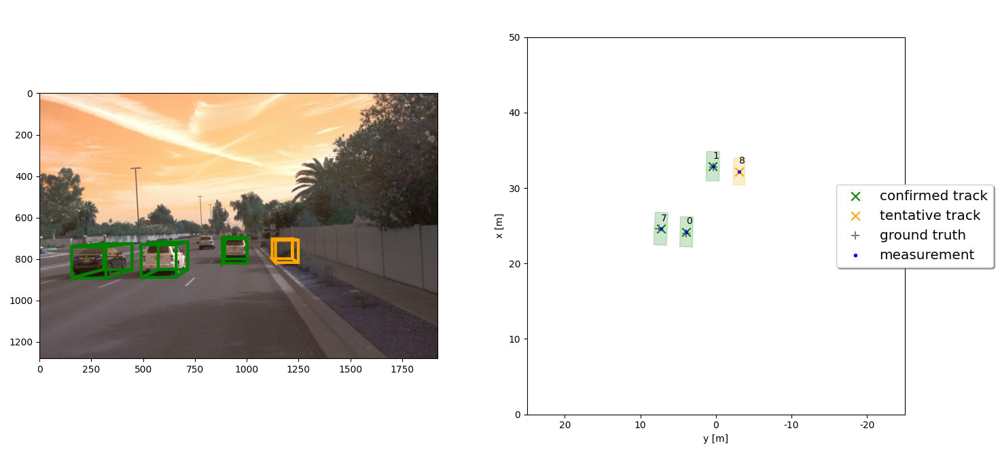
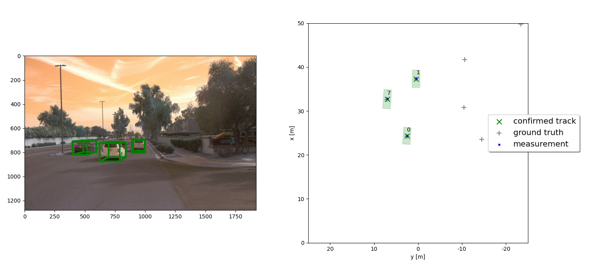
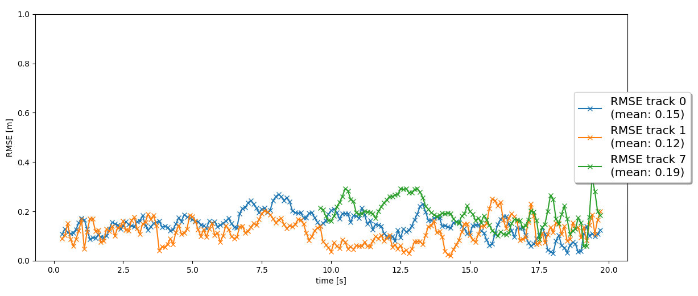
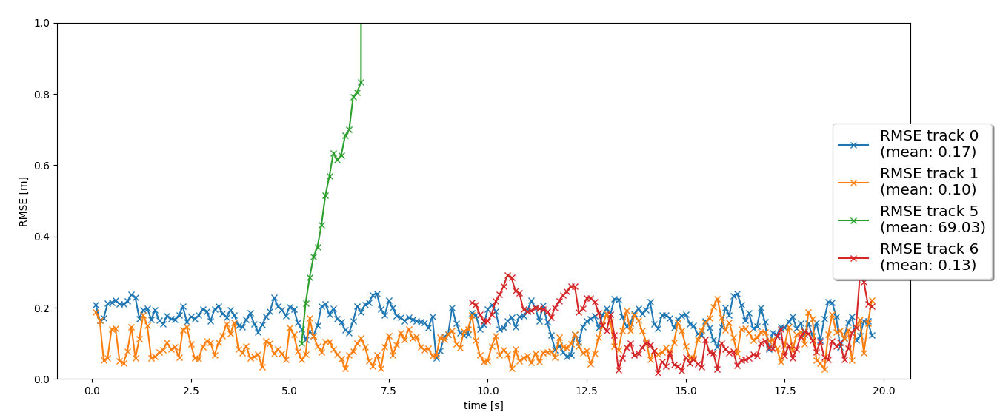

# Writeup: Track 3D-Objects Over Time

## Step 1: EKF Filter for tracking

## Step 2: Track management, initialize, update and delete

## Step 3: Measurement association

## Step 4: Camera and LIDAR sensor fusion for tracking

<video width="800" height="600" controls>
  <source src="resources/my_tracking_results.mp4" type="video/mp4">
</video>

Please use this starter template to answer the following questions:

### 1. Write a short recap of the four tracking steps and what you implemented there (filter, track management, association, camera fusion). Which results did you achieve? Which part of the project was most difficult for you to complete, and why?

### 2. Do you see any benefits in camera-lidar fusion compared to lidar-only tracking (in theory and in your concrete results)? 

### 3. Which challenges will a sensor fusion system face in real-life scenarios? Did you see any of these challenges in the project?

### 4. Can you think of ways to improve your tracking results in the future?

