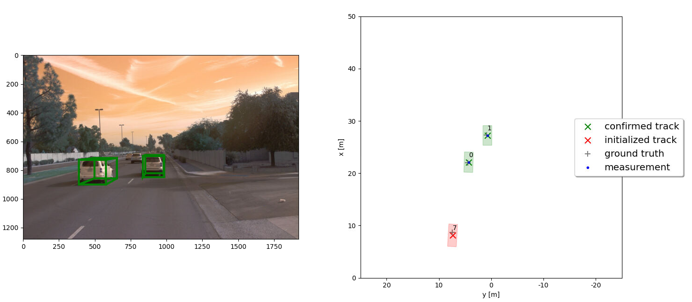

# Writeup: Track 3D-Objects Over Time

## Step 1: EKF Filter for tracking

Firstly, a EKF filter was implemented to track a single object with given measurements. Predict and update functions were implemented. 

In the following figure, an instance where this EKF was applied is viualized. On the left side, tracking result is drawn in the camera view and range X,Y position tracking is shown in the right side plot.

As the time progresses, root mean squared error in between the tracked vehicle position and ground truth is plotted in the figure below. Average RMSE of 0.32 m was observed.

## Step 2: Track management, initialize, update and delete

Next important step in tracking is track management which deals with initializing tracking for newly observations that cannot be associated to the existing tracks, updates the tracks with observations related to existing tracks, or delete tracks where observations are no longer exist. How track management state transition occurs is drawn in the following figure. 

               

Following is a scenario where tracked object is 'Confirmed'

In the given sample data, while track maangement is performed, a RMSE of 0.78 m was observed.

## Step 3: Measurement association

LIDAR or any similar sensor will have many measurements. Questions is which measurement is related to which object. Association is about how to map each measurement observations to each tracked object. This is typically done by associating the measurements to the closest object based on geodesic distance, and advanced association algorithms use object motion models. Following are some screenshots from tracking multiple objects with track association in place.

Following is an instance where 3 multiple objects are tracked and all in 'Confirmed' state

Following is an instance where 3 multiple objects are tracked, 2 'Confirmed' and 1 'Tentative' state for a false detection for a bush

Following is an instance where 3 multiple objects are tracked, 2 'Confirmed' and 1 set to be deleted as it is no longer in observations.

Another instance 3 multiple objects being tracked with all are in the 'Confirmed' state.

An instance where 4 multiple objects are being tracked, 3 'Confirmed' and 1 'Tentative' for a false detection for a bush aside.

Following is a RMSE plot for all the 'confirmed' objects for the given sample data. Please note different track object IDs 
are assigned as the track management initializes new tracks. All 'Confirmed' tracks had well less than 0.20 m of RMSE. 

## Step 4: Camera and LIDAR sensor fusion for tracking

Sensor fusion enables camera and LIDAR sensors to augment each other while getting the best of both sensing, and reducing the impact by degraded performance or absense of one sensor modality from time to time.

Following a video of the camera and LIDAR sensor track fusion for the given sample data.

https://user-images.githubusercontent.com/58986949/115314310-805b2780-a1a7-11eb-8558-648a367ea231.mp4

For the tracking results with sensor fusion, please have a look here. https://www.youtube.com/watch?v=P3EweEKesB8

Following is the plotting of RMSE for the above tracking scenario. It can be seen tracking is more robust with the fusion of camera and LIDAR sensors. 

Note: Track #5 seems an exceptional case where its RMSE recorded high value (69.03 m). It will be intersting see how this error occured. Track #5 cannot be observed clearly in the recorded video, possibly it appear and disappear quickly out of the FOV.

https://github.com/pwkalana9/udacity_sensor_fusion_and_object_tracking/blob/master/resources/my_tracking_results.mp4

### 1. Write a short recap of the four tracking steps and what you implemented there (filter, track management, association, camera fusion). Which results did you achieve? Which part of the project was most difficult for you to complete, and why?

Key steps in the vehicle tracking using LIDAR and camera sensors are as follows

1) Capture new measurements data from the sensors (both LIDAR and camera)
2) Detect the vehicles using pre-trained machine learning models on LIDAR and camera data and transform the detections into a common sensor coordinate system
3) Use the measurements association to decide whether the measurement is for an existing For new observations (), initialize ('TENTATIVE') new tracks for new observations.
4) When sufficient threshold of observed detection for the new objects, those become 'CONFIRMED'
4) For existing tracks keep predictions with Kalman filter, and update them when new sensor measurements are observed
5) If the existing objects are not observed in the measurements consecutively its uncertainity increases, and after uncertainity passes the threshold, object becomes 'TENTATIVE' again.
6) If the 'TENTATIVE' object did not have any further mesurements, it will be marked 'DELETED'.
7) While camera-sensor fusion is fully implemented, measurements from both the LIDAR and camera are used to update. Fusion enables to get the best outcome of both modalities, and reduce impact of loosing or uncertainity of one sensor modality.

     

I think 'Association' part is the most difficult part, due to the complexity of the implementatio. Also, in theory 'Association' has most of the problems, such as vehicles travelling close by, or mis detection being associated to the vehicles, etc.

### 2. Do you see any benefits in camera-lidar fusion compared to lidar-only tracking (in theory and in your concrete results)? 

Definately camera-lidar sensor fusion enables improved accuracy as compared to having just one modality. Having multiple modalities allows confirming the objects before they are being tracked as object with uncertainity. 

### 3. Which challenges will a sensor fusion system face in real-life scenarios? Did you see any of these challenges in the project?

False detections for objects such as bushes were observed in the project. Conceptual challenge in this scenario is whether the object should be observed by all modalities before confirming or observation by out of just one modality is sufficient. In scenarios like bad weather (rain, snowing, direct sun-light), camera modality will be severly affected. Accidental odd objects (fallen big boxes on the road) or intentionally setup system-fooling ways, even LIDAR could not correctly detect.  

### 4. Can you think of ways to improve your tracking results in the future?

Following could be some ways to improve the accuracy in tracking results
a) Use more sensor modalities such as Radar, bumper sensors, hyper-spectral sensors
b) Improve the machine learning models to detect the objects
c) Context specific sensor fusion (e.g. bad weather, rainy, direct light, snowy)
d) In addition to the vehicle on-board sensors, communicate with intelligent infrastructure (Road side units, traffic data, etc)
